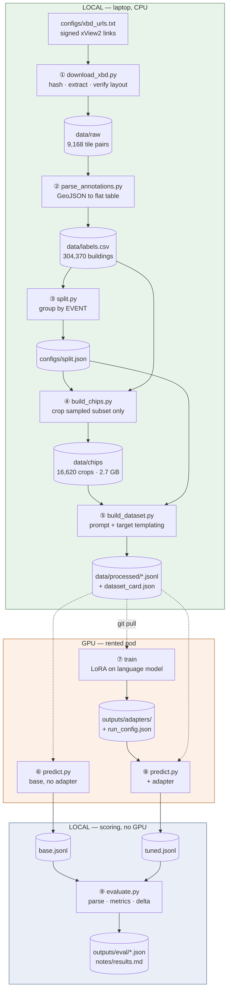
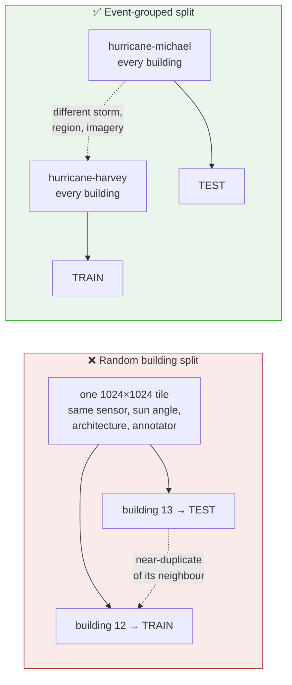
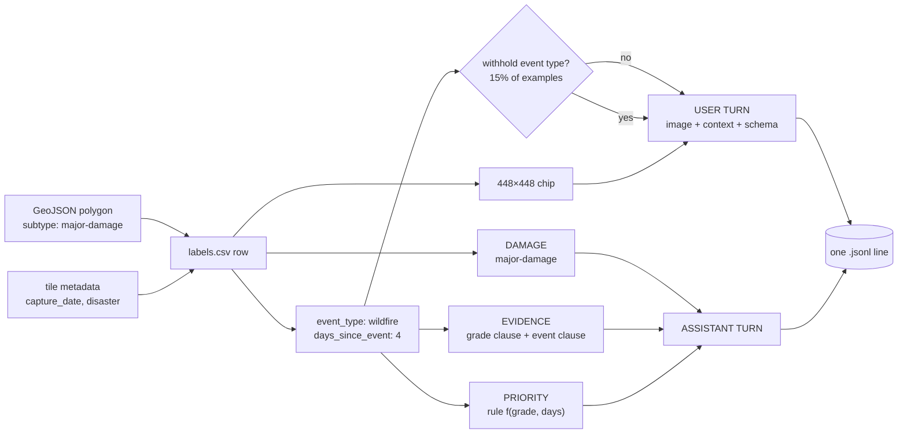
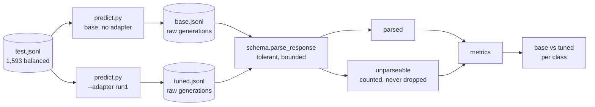

# Architecture

How the pipeline is put together, stage by stage, and the reasoning behind each
design decision. For *why the project exists* start at the [README](../README.md);
for *the choices and their costs in prose* see [decisions.md](decisions.md).

---

## The pipeline end to end



The repo is the unit of transfer: `git push` locally, `git pull` on the pod.
Data and adapters live on the pod's network volume and never travel. **Never
edit code on the pod.** Setup for the rented box: [pod-setup.md](pod-setup.md).

---

## ① Acquire — `download_xbd.py`

Takes signed links from `configs/xbd_urls.txt` rather than credentials: nothing
to store, and no login scraper to break when the site changes. Prechecks disk,
resumes partial transfers, joins multipart archives, refuses the GeoTIFF release
(needs GDAL, different layout), records sha256 into [dataset.md](dataset.md), and
verifies the extracted tree matches what the parser expects.

`--from-local` routes browser-downloaded archives through the same path.

## ② Parse — `parse_annotations.py`

Walks every `*_post_disaster.json` and emits one CSV row per graded polygon.
Damage grades live on the **post**-event annotations under
`features.xy[].properties.subtype`; pre-event annotations carry footprints
without grades and are not read. Polygon WKT is parsed dependency-free and
reduced to centroid, bbox and shoelace area.

`days_since_event` is derived from the tile's capture date minus an event date
table in `xbd_vlm/events.py`, not invented.

**Real class distribution — the reason class balance gets its own stage:**

| grade | count | share |
|---|---|---|
| no-damage | 233,635 | 76.8% |
| minor-damage | 25,724 | 8.5% |
| major-damage | 21,449 | 7.0% |
| destroyed | 23,562 | 7.7% |

## ③ Split — `split.py`

Whole disaster events are assigned to train / val / test. Nothing else works:



A random split puts near-duplicate neighbours from the same tile on both sides
of the wall, and the reported accuracy measures tile memorisation rather than
transfer to the next disaster. **This deliberately deviates from the official
xView2 split**, which is drawn *within* events.

The cost is coverage: hold out a whole event and you may hold out the only
instance of its type. The script reports per-type coverage and warns.

**Resulting assignment — 6 of 7 event types testable cross-event:**

| event type | train | val | test |
|---|---|---|---|
| hurricane | harvey, florence | matthew | michael |
| wildfire | portugal, woolsey, pinery | socal | santa-rosa |
| tornado | moore | tuscaloosa | joplin |
| flood | nepal | – | midwest |
| tsunami | palu | – | sunda |
| volcanic-eruption | lower-puna | – | guatemala |
| earthquake | mexico | – | ⚠ none |

Earthquake cannot be held out — `mexico-earthquake` is xBD's only earthquake.
That is a dataset limitation, stated rather than worked around.

## ④ Chip — `build_chips.py`

Crops one square window per building, centred on the polygon centroid, side =
larger bbox dimension × 3.0 clamped to [128, 512] px, resized to **448** (16 × 28,
matching Qwen's patch grid).

**Runs after split, and crops only the sampled subset.** xBD has ~850k polygons
and this project uses ~8k; chipping everything would produce hundreds of GB that
nothing references. Selection is a deterministic hash of the building uid
(`xbd_vlm/sampling.py`), so `build_dataset.py` independently arrives at exactly
the same rows without the two scripts coordinating.

Two documented trade-offs:

- **Adaptive vs fixed window.** Adaptive guarantees the building fits, but since
  every chip is resized to 448 the apparent scale varies, so absolute building
  size is not readable. `--mode fixed` preserves scale and clips large
  structures. Cropping the subject is the worse failure.
- **No polygon outline by default.** Drawing the target's outline removes
  "which building?" ambiguity but paints a non-photographic cue the model will
  learn — one that does not exist at inference on unlabelled imagery. Available
  behind `--outline` as an ablation.

## ⑤ Build dataset — `build_dataset.py`

How one polygon becomes one training example:



**Class balance.** Training on the natural 77% no-damage distribution yields a
model that answers "no-damage" and scores 77%. Per-class caps fix that. The test
set is capped the same way, which means **reported accuracy is not a deployment
figure** — it is per-class skill measured with enough samples per class to
support the number.

**Both context fields are made load-bearing on purpose.** If event type were
perfectly readable from the pixels, the model could ignore the prompt entirely,
and swapping it at demo time would show brittleness rather than conditioning.
Three countermeasures:

1. `EVIDENCE` phrasing is conditioned on event type, so the field changes the
   correct target.
2. `PRIORITY` is conditioned on `days_since_event`, which reaches the model
   **only** through prompt text and cannot be read off the image at all.
3. Event type is withheld on 15% of training examples, so the field must be read
   rather than assumed.

This is conditioning **by construction, not emergent**. The demo shows the model
learned what was built in; it does not show the model discovered that hurricanes
and wildfires differ.

---

## Output schema

Three fields, fixed order, one per line:

```
DAMAGE: major-damage
EVIDENCE: Substantial roof failure exposing the structure's interior; burn scars and ash across the surrounding vegetation.
PRIORITY: high
```

Chosen over JSON deliberately: fewer tokens on punctuation, and a malformed
generation degrades to "one field missing" rather than "the whole object failed
to parse" — which makes the unparseable-rate metric informative about *what*
went wrong.

| field | source | honest description |
|---|---|---|
| `DAMAGE` | xBD subtype, verbatim | the actual label |
| `EVIDENCE` | templated from grade × event type | **format learning, not grounded reasoning** |
| `PRIORITY` | rule: f(grade, days_since) | **a stated rubric, not learned judgement** |

xBD supplies no rationale text, so `EVIDENCE` is manufactured. A correct evidence
sentence is *not* proof the model attended to the right region. The honest
upgrade is distilling rationales from a stronger VLM conditioned on the known
grade — deliberately out of scope. See [decisions.md](decisions.md).

The schema, its parser, and the triage rule live in exactly one file
(`xbd_vlm/schema.py`). Nothing else reads or writes the format.

---

## Evaluation



Inference and scoring are separate scripts on purpose: metric code was developed
and tested before a single GPU hour was spent, and re-scoring after a schema fix
costs nothing.

| metric | what it catches |
|---|---|
| **QWK** | ordinal agreement corrected for chance. A constant predictor scores 0 regardless of how good its accuracy looks. |
| **macro F1** | rare-class skill. Collapses when a class is never predicted. |
| **ordinal MAE** | distinguishes minor↔major confusion from no-damage↔destroyed. |
| **adjacent vs distant error** | reported separately — they are different failures. |
| **unparseable rate** | counted, never dropped. A model that emits prose 20% of the time is worse than one that doesn't. |
| **accuracy, two denominators** | `accuracy_parsed` is skill given usable output; `accuracy_all` charges for failures. Reporting only the first flatters a model with a high failure rate. |

`smoke_test.py` pins the intuition with synthetic data: an always-"no-damage"
model scores **0.81 accuracy and 0.00 QWK** on a naturally distributed set. If
that ever stops holding, the metrics are wrong and every number downstream is
wrong.

**Discipline:** validation is for deciding when to stop training. Test is scored
once, at the end. Tuning against test between runs converts test into validation
and inflates the headline.

---

## Reproducibility

An adapter is meaningless without the prompt template it was trained on. If
inference reconstructs the prompt differently, accuracy drops and nothing in the
logs explains it.

`prompts.template_fingerprint()` hashes the prompt version, system prompt, schema
description, both prompt shapes, the mask rate, and every evidence clause. It is
written into the dataset card and each adapter's `run_config.json`, and
**`predict.py` refuses to run** an adapter whose fingerprint does not match the
current `prompts.py`.

Dataset files are sha256'd into `dataset_card.json`. Sampling is a deterministic
hash of the building uid — same inputs, same dataset, byte for byte, on any
machine.

---

## Repo layout

```
xbd_vlm/                  shared library — the only code that touches the schema
  schema.py               output format, parser, triage rule
  prompts.py              prompt template + evidence templating (versioned, hashed)
  events.py               event type and date per disaster
  sampling.py             deterministic uid-hash selection
  metrics.py              per-class, QWK, ordinal MAE, unparseable rate
scripts/
  download_xbd.py         xView2      → data/raw + hashes         [CPU]
  parse_annotations.py    GeoJSON     → data/labels.csv           [CPU]
  split.py                labels.csv  → configs/split.json        [CPU]
  build_chips.py          labels.csv  → per-building crops        [CPU]
  build_dataset.py        labels.csv  → data/processed/*.jsonl    [CPU]
  train.py                jsonl       → LoRA adapter + run_config  [GPU]
  predict.py              jsonl       → raw generations           [GPU]
  predict_mlx.py          jsonl       → raw generations      [Apple silicon]
  evaluate.py             generations → metrics + delta table     [CPU]
  smoke_test.py           synthetic end-to-end check, no data needed
configs/                  split assignment, training configs
outputs/adapters/         trained adapters (gitignored)
outputs/eval/             metrics json (tracked — the results are the point)
notes/                    plan · decisions · dataset · results · pod-setup
.githooks/pre-commit      blocks secrets from entering history
```
